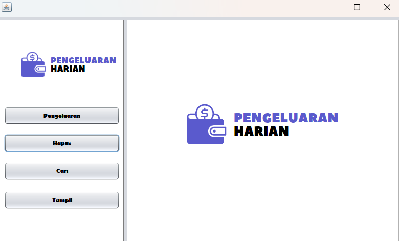
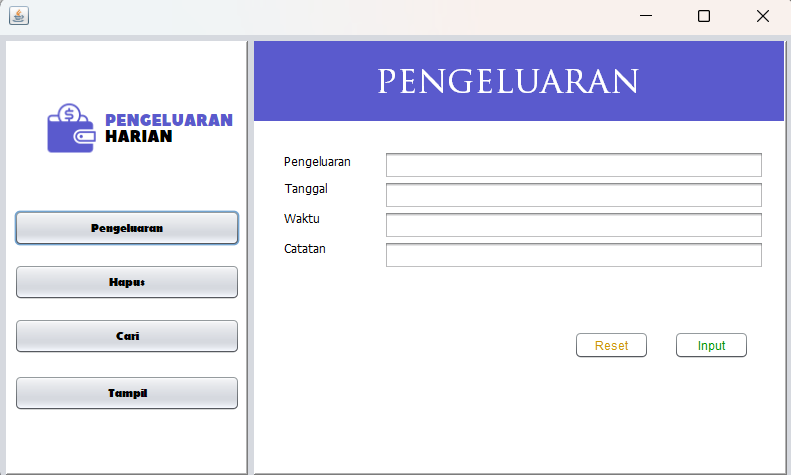
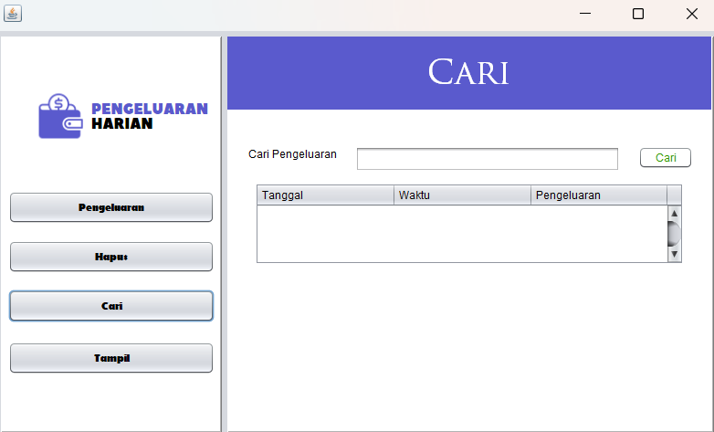
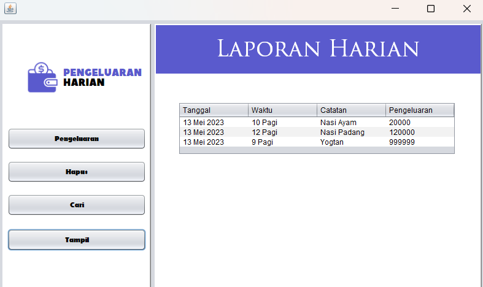

# Pemantau Pengeluaran Harian

Ini adalah program berbasis GUI sederhana yang ditulis dalam bahasa Java untuk membantu pengguna dalam memantau pengeluaran harian mereka. Program ini menyediakan fitur untuk menginput, menghapus, mencari, dan menampilkan catatan pengeluaran harian.

## Fitur

- Menambahkan catatan pengeluaran baru dengan memasukkan tanggal, waktu, catatan, dan jumlah pengeluaran.


- Menghapus catatan pengeluaran yang sudah ada berdasarkan entri yang dipilih.


- Mencari catatan pengeluaran menggunakan kata kunci pengeluaran.


- Menampilkan laporan pengeluaran harian.

## Persyaratan

- Java Development Kit (JDK)
- Pustaka JavaFX

## Instalasi

1. Clone repository ini:

   ```bash
   git clone https://github.com/username-anda/pemantau-pengeluaran-harian.git
   ```

2. Buka proyek di Integrated Development Environment (IDE) Java favorit Anda.

3. Siapkan pustaka JavaFX pada IDE Anda. Pastikan konfigurasi JavaFX sudah benar agar dapat menjalankan aplikasi JavaFX.

## Penggunaan

1. Jalankan program dari IDE Anda.

2. Jendela GUI akan muncul, memungkinkan Anda berinteraksi dengan program.

3. Untuk menambahkan catatan pengeluaran baru, masukkan tanggal, waktu, dan jumlah pengeluaran pada kolom yang tersedia, kemudian klik tombol "Tambah".

4. Untuk menghapus catatan pengeluaran, pilih entri yang ingin dihapus dari daftar dan klik tombol "Hapus".

5. Untuk mencari pengeluaran, masukkan kata kunci pada kolom pencarian dan klik tombol "Cari". Program akan menampilkan semua catatan pengeluaran yang sesuai.

6. Untuk menampilkan laporan pengeluaran harian, pilih tanggal pada kalender dan klik tombol "Tampilkan Laporan". Program akan menampilkan semua catatan pengeluaran yang tercatat untuk tanggal tersebut.

7. Gunakan tombol "Reset" untuk mengosongkan kolom input dan hasil pencarian.


## Pengakuan

- Antarmuka GUI dibangun menggunakan pustaka JavaFX.
- Struktur dan desain program terinspirasi dari berbagai aplikasi pemantau pengeluaran.

Silakan sesuaikan program ini sesuai dengan kebutuhan Anda.
